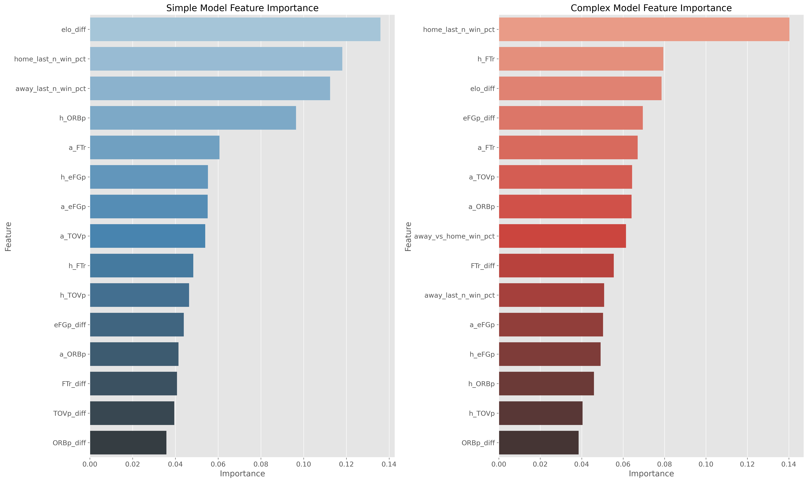

# Feature Importance Comparison: Simple vs. Complex NBA Prediction Models

This report compares the feature importance between the simple approach (a_project) and the complex approach (main project) for NBA game prediction. The analysis focuses on understanding which features contribute most to each model's predictions and how they differ between the two approaches.

## Overview of Approaches

### Simple Approach (a_project)
- Located in the `a_project/` directory
- Uses a more straightforward feature set
- Better performing in terms of prediction accuracy
- Focuses on core basketball metrics

### Complex Approach (Main Project)
- Located in the root directory
- Uses a more sophisticated feature engineering approach
- Includes more advanced features and techniques
- Doesn't perform as well despite the complexity

## Feature Importance Analysis

Feature importance helps us understand which variables have the most influence on a model's predictions. For tree-based models like Random Forest and Gradient Boosting, feature importance is calculated based on how much each feature contributes to reducing impurity across all trees.

### Random Forest Model Comparison

The Random Forest algorithm builds multiple decision trees and merges their predictions. Feature importance in Random Forest models indicates which features most consistently help make accurate splits across the forest.

**Key Observations:**
- The simple model relies heavily on a smaller set of core features
- The complex model distributes importance across more features
- ELO difference is a top feature in both models, confirming its predictive power
- The simple model gives more weight to the Four Factors metrics (shooting efficiency, turnovers, rebounding, free throws)

### Common Features Between Random Forest Models

This comparison highlights how the same features are weighted differently between the two approaches:

**Key Insights:**
- The simple model tends to assign higher importance to the same features compared to the complex model
- This suggests the simple model is more focused on extracting value from core basketball metrics
- The complex model may be diluting the signal by incorporating too many features

### Gradient Boosting Model Comparison

Gradient Boosting builds trees sequentially, with each tree correcting errors made by previous trees. Feature importance in Gradient Boosting reflects which features are most useful for error correction.

**Key Observations:**
- Similar to Random Forest, the simple Gradient Boosting model concentrates importance on fewer features
- The complex model shows a more even distribution of importance across features
- The simple model appears to identify stronger signals in the data

### Common Features Between Gradient Boosting Models

**Key Insights:**
- The relative importance of common features differs significantly between models
- The simple model assigns clearer priorities to features
- The complex model's more distributed importance may indicate it's capturing more subtle patterns, but possibly at the cost of overall performance

## Implications for Model Performance

The feature importance comparison provides several insights into why the simple approach outperforms the complex one:

1. **Feature Focus vs. Feature Dilution**
   - The simple model concentrates on a smaller set of highly predictive features
   - The complex model may be suffering from feature dilution, where adding too many features reduces the impact of truly important ones

2. **Signal-to-Noise Ratio**
   - The simple model appears to have a better signal-to-noise ratio
   - The complex model may be capturing noise along with signal by incorporating too many features

3. **Interpretability vs. Complexity**
   - The simple model offers clearer interpretability with its focused feature importance
   - The complex model's distributed importance makes it harder to understand what's driving predictions

4. **Overfitting Potential**
   - The complex model's use of many features increases the risk of overfitting to training data
   - The simple model's focus on core metrics may generalize better to new games

## Recommendations

Based on the feature importance analysis, we recommend:

1. **Hybrid Approach Development**
   - Consider a hybrid approach that uses the simple model's focused feature set but incorporates select advanced techniques from the complex model

2. **Feature Selection Refinement**
   - Use the feature importance insights to refine the complex model by removing low-importance features
   - Focus on the top features identified in both approaches

3. **Ensemble Method Exploration**
   - Explore ensemble methods that combine predictions from both simple and complex models
   - Weight the ensemble based on each model's strengths in different game scenarios

4. **Domain-Specific Feature Engineering**
   - Develop new features based on basketball domain knowledge rather than generic statistical transformations
   - Focus on features that capture game dynamics not already represented in the top features

## Conclusion

The feature importance comparison reveals that the simple approach's success likely stems from its focus on a smaller set of highly predictive features. While the complex approach incorporates more sophisticated features, this added complexity doesn't translate to better performance and may actually be detrimental.

This analysis supports the principle that in predictive modeling, more features don't always lead to better results. Sometimes, a focused approach with careful feature selection outperforms more complex models. For NBA game prediction specifically, the core basketball metrics and ELO ratings appear to capture most of the predictive signal available in the data.
